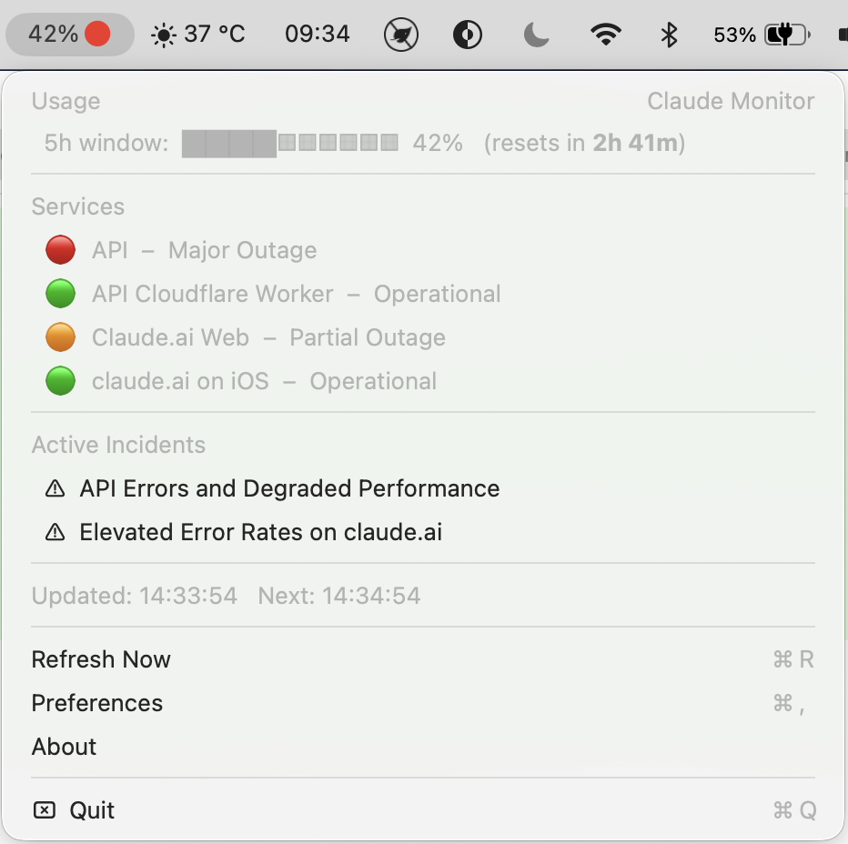
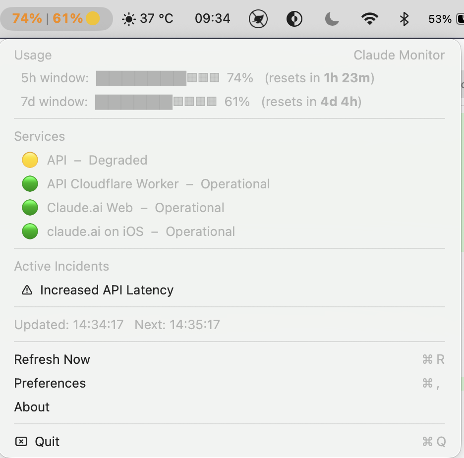
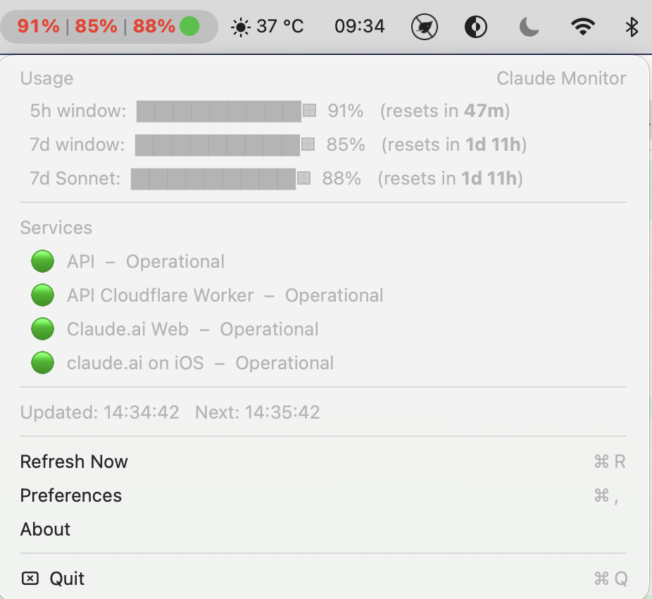
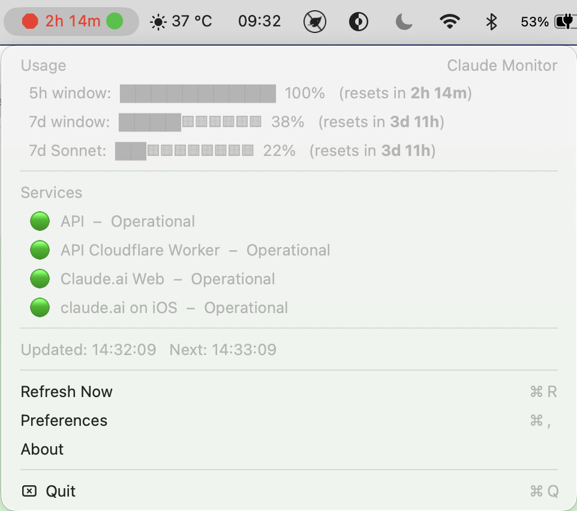

# ClaudeMonitor

macOS menu bar app that monitors Claude AI usage limits and Anthropic service status.

## Install

1. Download `ClaudeMonitor.zip` from [Releases](https://github.com/xerno/ClaudeMonitor/releases)
2. Unzip and move `ClaudeMonitor.app` to `/Applications`
3. On first launch macOS will block the app — go to **System Settings → Privacy & Security** and click **Open Anyway**

## Screenshots

| Active outage | High usage |
|:---:|:---:|
|  |  |
| 5h window, major API outage | 5h + 7d windows, API degraded |

| Critical usage | 5h limit reached |
|:---:|:---:|
|  |  |
| All three windows, all systems OK | 5h window exhausted, countdown to reset |
