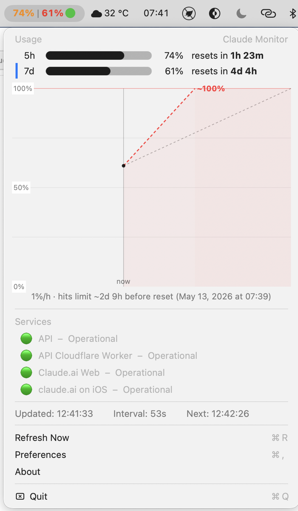
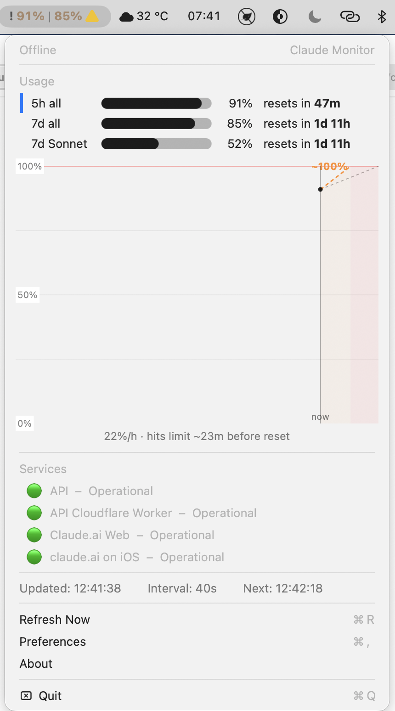
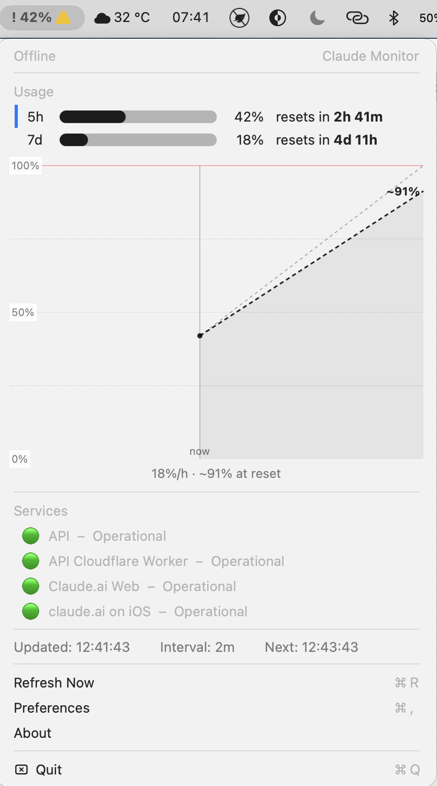

# ClaudeMonitor

macOS menu bar app that monitors Claude AI usage limits and Anthropic service status.

## Install

1. Download `ClaudeMonitor.zip` from [Releases](https://github.com/xerno/ClaudeMonitor/releases)
2. Unzip and move `ClaudeMonitor.app` to `/Applications`
3. On first launch macOS will block the app — go to **System Settings → Privacy & Security** and click **Open Anyway**

## Screenshots

| | |
|:---:|:---:|
|  |  |
|  |  |
|  |  |

